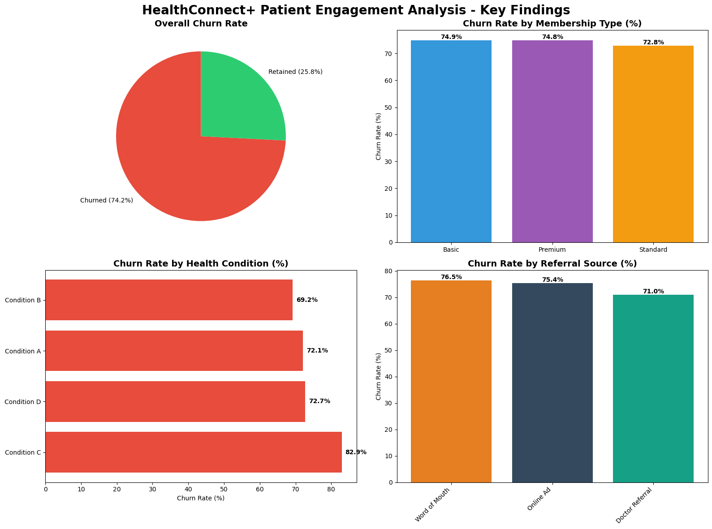

# HealthConnect+ Patient Engagement & Retention Analysis

## Project Overview

HealthConnect+ is experiencing a critical patient retention issue with a **74.2% churn rate**. This comprehensive data analysis project identifies key factors influencing patient engagement, develops predictive models, and provides actionable intervention strategies to improve retention.

## Key Findings

### 1. High-Risk Patient Groups
- **Condition C patients** show the highest churn rate at **82.9%**
- **Rural patients** are **2.4% more likely** to churn than urban patients
- **Word-of-mouth referrals** have **5.5% higher churn** than doctor referrals

### 2. User Segmentation Results
Machine learning clustering identified **4 distinct user segments** with varying retention patterns:

.png)

### 3. Critical Retention Drivers
Feature importance analysis revealed the top factors influencing retention:

.png)

