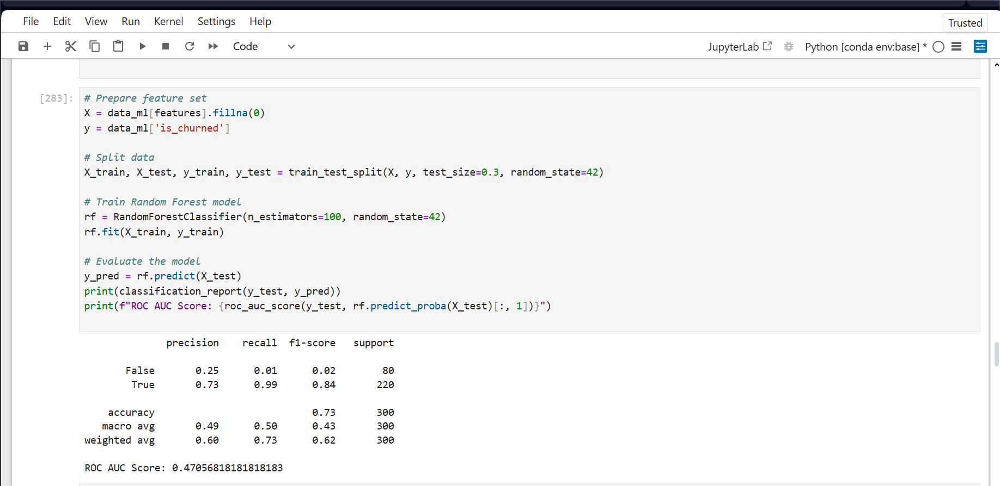
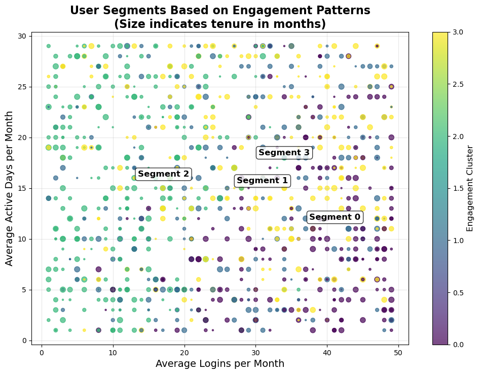
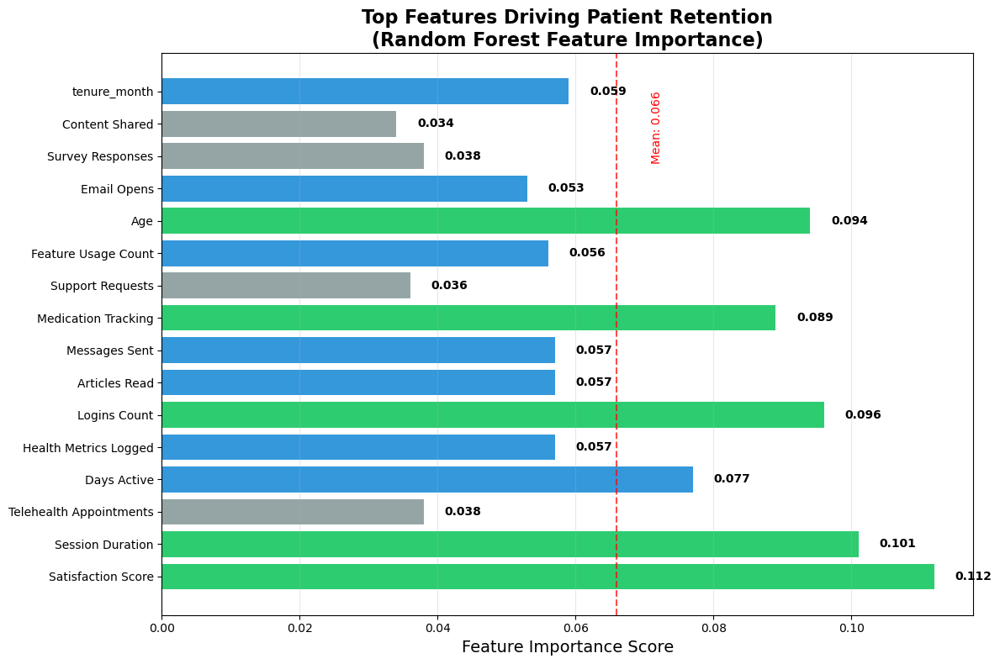

# HealthConnect+ Patient Engagement & Retention Analysis

## Project Overview

HealthConnect+ is a digital health platform that offers telemedicine services, medication management,
health tracking, and educational resources. The company is concerned about
patient engagement and retention rates. This project aims to analyze patient data to understand
engagement patterns, identify churn risk factors, and recommend intervention strategies. 

## Business Objectives

1. Identify key factors influencing patient engagement with the platform
2. Analyze patterns of user behavior that predict churn
3. Segment users based on engagement patterns
4. Recommend data-driven intervention strategies for improving retention

## Data Dictionary

### Patient Demographics (`patient_demographics.csv`)

| Column Name | Description | Data Type |
|-------------|-------------|-----------|
| patient_id | Unique identifier for each patient | Integer |
| age | Age of the patient | Integer |
| gender | Gender of the patient | String |
| location | Geographic location type (Urban/Suburban/Rural) | String |
| insurance_type | Type of insurance coverage | String |
| join_date | Date when patient joined the platform | Date |
| membership_type | Level of membership (Basic/Standard/Premium) | String |
| referral_source | How the patient was referred to the platform | String |
| education_level | Highest level of education completed | String |
| income_bracket | Income level category (Low/Medium/High) | String |
| household_size | Number of people in household | Integer |

### Health Conditions (`health_conditions.csv`)

| Column Name | Description | Data Type |
|-------------|-------------|-----------|
| patient_id | Unique identifier for each patient | Integer |
| health_condition_primary | Main health condition being managed | String |
| condition_severity | Severity of the condition (Mild/Moderate/Severe) | String |
| condition_duration_years | Years since diagnosis | Integer |
| medication_count | Number of medications prescribed | Integer |
| comorbidities_count | Number of additional health conditions | Integer |
| chronic_condition | Whether condition is chronic (Yes/No) | String |
| preventative_care | Whether patient receives preventative care (Yes/No) | String |
| risk_score | Overall health risk assessment (Low/Medium/High) | String |
| care_plan_adherence | Level of adherence to care plan | String |
| last_checkup_date | Date of most recent checkup | Date |

### Engagement Metrics (`engagement_metrics.csv`)

| Column Name | Description | Data Type |
|-------------|-------------|-----------|
| patient_id | Unique identifier for each patient | Integer |
| month | Month of activity data | Integer |
| year | Year of activity data | Integer |
| logins_count | Number of times patient logged in | Integer |
| days_active | Number of days with platform activity | Integer |
| telehealth_appointments | Number of telehealth visits completed | Integer |
| articles_read | Number of educational articles viewed | Integer |
| messages_sent | Number of messages sent to providers | Integer |
| medication_tracking_days | Days medication tracking was used | Integer |
| health_metrics_logged | Number of health metrics recorded | Integer |
| satisfaction_score | User satisfaction rating (0-5) | Float |
| session_duration_avg | Average session length in minutes | Float |
| support_requests | Number of support requests made | Integer |
| feature_usage_count | Number of unique features used | Integer |
| content_shared | Number of items shared from platform | Integer |
| medication_reminders_enabled | Whether medication reminders are active (0/1) | Binary |
| push_notifications_enabled | Whether push notifications are active (0/1) | Binary |
| email_opens | Number of platform emails opened | Integer |
| app_version | Version of app being used | Float |
| device_type | Type of device used (Mobile/Tablet/Desktop) | String |
| survey_responses | Number of surveys completed | Integer |

## Tools & Technologies

- **Python** - Primary programming language
- **Pandas** - Data manipulation and analysis
- **NumPy** - Numerical computations
- **Matplotlib & Seaborn** - Data visualization
- **Scikit-learn** - Machine learning for clustering and prediction
- **Jupyter Notebook** - Interactive development environment

## Analysis Approach

### 1. Exploratory Data Analysis
- Investigated patterns in engagement metrics
- Analyzed demographic factors that correlate with engagement
- Identified trends in health condition impact on platform usage

### 2. Cohort Analysis
- Grouped users by join date cohorts
- Tracked retention rates over time
- Compared engagement patterns across cohorts

### 3. Churn Prediction Modeling
- Defined churn criteria based on platform inactivity (3+ months)
- Built predictive models to identify at-risk patients
- Determined key factors contributing to churn

### 4. User Segmentation
- Created user segments based on engagement patterns
- Analyzed health outcomes across segments
- Developed targeted intervention strategies for each segment

### 5. Seasonal Pattern Analysis
- Identified seasonal trends in engagement
- Analyzed usage patterns throughout the year
- Developed season-specific recommendations

## Key Findings

### Overall Insights
- **High Churn Rate**: Overall churn rate is 74.20%, indicating significant retention challenges
- **Engagement Scoring**: Created an engagement scoring system to categorize patients and predict churn
  
### Demographic Patterns
- **Membership Type Impact**: Standard membership has slightly lower churn (72.84%) compared to Basic (74.86%) and Premium (74.84%)
- **Location Influence**: Urban patients show lower churn (72.67%) than Suburban (75.08%) and Rural (74.79%) patients

### Health Condition Analysis
- **Condition C Patients**: Highest churn rate at 82.93%
- **Condition B Patients**: Lowest churn rate at 69.23%

### Referral Source Impact
- **Doctor Referrals**: Lowest churn rate (70.97%)
- **Word of Mouth**: Highest churn rate (76.45%)

### Machine Learning Results
- Prediction model achieved 73% accuracy in identifying at-risk patients
- Key predictors include login frequency, session duration, and feature usage diversity
- The model achieved a ROC AUC score of 0.471, reflecting challenges with the highly imbalanced dataset (74.2% churn rate). While the model excels at identifying churned patients (98% recall), it struggles to correctly identify patients who will stay. This presents an opportunity for future work using balanced sampling techniques or threshold optimization.

### User Segmentation Results
Machine learning clustering identified **4 distinct user segments** with varying retention patterns:

### Critical Retention Drivers
Feature importance analysis revealed the top factors influencing retention:

## Recommendations

### 1. Segment-Specific Interventions
- **For Disengaged Users**: Simplified onboarding redux and quick value demonstration
- **For Feature Explorers**: Guided feature tours and progress visualization campaigns
- **For Selective Specialists**: Feature depth expansion and cross-feature integration
- **For Power Users**: Beta feature access program and health ambassador program
- **For Condition C Patients**: Specialized support community and targeted content packages

### 2. Seasonal Intervention Strategies
- **Winter**: Focus on telehealth services and annual health planning
- **Spring**: Implement health challenges and educational content push
- **Summer**: Launch activity trackers and family health features
- **Fall**: Run back-to-routine campaigns and preventative care initiatives

### 3. Feature Enhancement Priorities
- Improve medication tracking features
- Enhance telehealth appointment experience
- Upgrade health metrics visualization
- Develop interactive educational content
- Optimize provider communication tools

## Conclusion
The HealthConnect+ platform shows significant promise, but requires systematic intervention to address the concerning churn rate. By implementing these targeted, data-driven strategies, we can dramatically improve user engagement and retention, particularly among high-risk segments like Condition C patients. With proper execution of this plan, we expect to transform the platform's retention metrics while delivering improved health outcomes for patients.

## Contact

For questions or feedback about this analysis, please contact [Doris Chisom](mailto:your.email@dorisogbu16@gmail.com).

